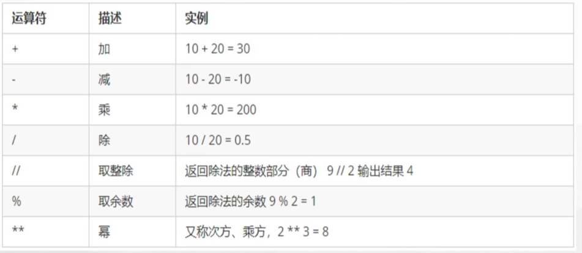
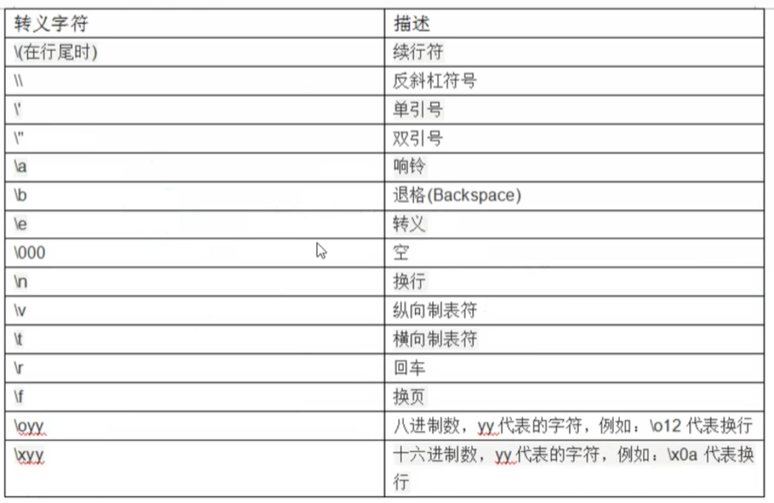

# 认识python

## 不想认识了

## 编写第一个程序

```python
print("hello word")
```

### debug

## 注释

### 函数

```python
print("1","2","3",sep="|")
#输出多个或者多句话是用都好隔开，用sep="|"来隔开==1|2|3。关键字参数包在后面
print("hello",end="")
print("word")
#print函数默认end="\n"，换行。
```

### 变量

```py
num1 = 3
#python变量
num2 = 4
total = num1 + num2
print(num1)
#7
a = num1
print(a)
#3
a = num2
print(a)
#4
# 没有优先级，从上倒下
```

### 变量命名规范

和c语言大同小异

### 数据类型

```py
# 整形
num = 1
print(type(num))
#<class 'int'>

# 浮点型
num = 1.1
print(type(num))
#<class 'float'>

#bool 布尔型
num = False
print(type(num))
#<class 'bool'>
print(int(num))
#0假1真
```


```py
#complex复数型
#z = a + bj a 为实部，b 为虚部， j是虚数单位。
num = 1 + 2j
print(type(num))
print(num.real)
```

### 格式化输出

```py
# 格式化输出
#占位符
print("hello %s" % "world")
#hello world
print("我的名字：%s，年龄：%d" % ("小明", 18))
#我的名字：小明，年龄：18
Name = "张三"
Age = 20
print("我的名字：%s，年龄：%d" % (Name, Age))
#我的名字：张三，年龄：20
print(f"我的名字：{Name}，年龄：{Age}")
#我的名字：张三，年龄：20
```

### 运算符



### 输入

```py
Name = input("asd")
print(Name)
```

### 转义字符




